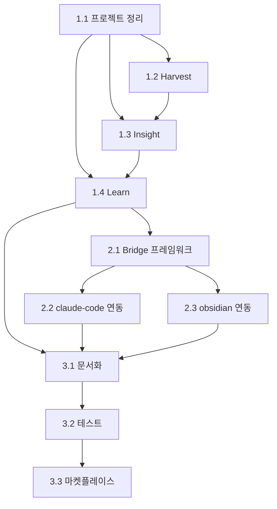

# Glean WBS (Work Breakdown Structure)

## 프로젝트 구조

```
Glean v1.0
├── Phase 1: Core 구현
│   ├── 1.1 프로젝트 정리
│   ├── 1.2 Harvest 엔진
│   ├── 1.3 Insight 분석기
│   └── 1.4 Learn 시스템
├── Phase 2: Bridge 구현
│   ├── 2.1 Bridge 프레임워크
│   ├── 2.2 claude-code 연동
│   └── 2.3 obsidian 연동
└── Phase 3: 출시 준비
    ├── 3.1 문서화
    ├── 3.2 테스트
    └── 3.3 마켓플레이스 등록
```

---

## Phase 1: Core 구현

### 1.1 프로젝트 정리
12개 플러그인 중 3개 핵심에 집중 (나머지는 보류, 삭제 안 함)

| ID | 태스크 | 산출물 | 상태 |
|----|--------|--------|------|
| 1.1.1 | 우선순위 정리 및 문서화 | README 업데이트 | ✅ |
| 1.1.2 | marketplace.json 업데이트 | marketplace.json | ✅ |

**Tier 1 (핵심 - 지금 구현)**:
- `harvest` - 세션 지식 수확
- `insight` - 인사이트 추출
- `learn` - 스페이스드 리피티션 학습

**Tier 2 (통합 - Phase 2)**:
- `bridge` (신규) - 플러그인 연동 허브

**Tier 3 (보류 - 나중에 구현 가능)**:
- stats, history, context, memory, plan, review, pr, sync, notify

### 1.2 Harvest 엔진
세션 지식 수확 핵심 로직 구현

| ID | 태스크 | 산출물 | 상태 |
|----|--------|--------|------|
| 1.2.1 | Harvest 데이터 스키마 정의 | types/harvest.ts | ✅ |
| 1.2.2 | 세션 분석 에이전트 작성 | agents/session-analyzer.md | ✅ |
| 1.2.3 | 파일 변경 추적 로직 | lib/file-tracker.js | ⏸️ |
| 1.2.4 | 커밋 정보 추출 | lib/git-extractor.js | ⏸️ |
| 1.2.5 | Harvest 저장 로직 | lib/harvest-store.js | ✅ |
| 1.2.6 | /harvest 명령어 구현 | commands/harvest.md (업데이트) | ✅ |
| 1.2.7 | 자동 수확 hook | hooks/auto-harvest.js | ✅ |

**핵심 구현**:
```javascript
// hooks/auto-harvest.js
export default {
  event: 'Stop',  // 세션 종료 시
  hooks: [{
    matcher: {},
    action: 'execute',
    command: '/harvest --mode quick --auto'
  }]
};
```

### 1.3 Insight 분석기
수확된 데이터에서 인사이트 추출

| ID | 태스크 | 산출물 | 상태 |
|----|--------|--------|------|
| 1.3.1 | Insight 데이터 스키마 정의 | types/insight.ts | ✅ |
| 1.3.2 | 패턴 인식 에이전트 | agents/pattern-recognizer.md | ✅ |
| 1.3.3 | 실수 분석 에이전트 | agents/mistake-analyzer.md | ✅ |
| 1.3.4 | 인사이트 저장 로직 | lib/insight-store.js | ✅ |
| 1.3.5 | /insight 명령어 구현 | commands/insight.md (업데이트) | ✅ |
| 1.3.6 | 인사이트 중복 제거 | lib/insight-store.js (checkDuplicate) | ✅ |

### 1.4 Learn 시스템 (스페이스드 리피티션)
장기 기억화를 위한 학습 시스템

| ID | 태스크 | 산출물 | 상태 |
|----|--------|--------|------|
| 1.4.1 | Learn 데이터 스키마 정의 | types/learn.ts | ✅ |
| 1.4.2 | SR 알고리즘 구현 | lib/spaced-repetition.js | ✅ |
| 1.4.3 | 학습 항목 저장소 | lib/learn-store.js | ✅ |
| 1.4.4 | /learn add 구현 | commands/learn.md | ✅ |
| 1.4.5 | /learn list 구현 | commands/learn.md | ✅ |
| 1.4.6 | /learn review 구현 | commands/learn.md | ✅ |
| 1.4.7 | /learn quiz 구현 | commands/learn.md | ✅ |
| 1.4.8 | 복습 알림 hook | hooks/review-reminder.js | ✅ |
| 1.4.9 | 인사이트 → 학습 자동 변환 | lib/learn-store.js (createFromInsight) | ✅ |

**핵심 구현**:
```javascript
// lib/spaced-repetition.js
export function calculateNextReview(confidence, lastReview) {
  const intervals = {
    5: 30,  // 30일
    4: 14,  // 14일
    3: 7,   // 7일
    2: 3,   // 3일
    1: 1    // 1일
  };
  const days = intervals[confidence] || 1;
  return addDays(lastReview, days);
}
```

---

## Phase 2: Bridge 구현

### 2.1 Bridge 프레임워크
플러그인 간 데이터 연동 기반

| ID | 태스크 | 산출물 | 상태 |
|----|--------|--------|------|
| 2.1.1 | Bridge 인터페이스 정의 | types/bridge.ts | ✅ |
| 2.1.2 | 플러그인 감지 로직 | lib/bridge/plugin-detector.js | ✅ |
| 2.1.3 | 데이터 포맷 변환기 | lib/bridge/data-transformer.js | ✅ |
| 2.1.4 | /bridge 명령어 | commands/bridge.md | ✅ |
| 2.1.5 | Bridge 설정 관리 | - | ⏸️ |

### 2.2 claude-code 연동
anthropics/claude-code와 데이터 연동

| ID | 태스크 | 산출물 | 상태 |
|----|--------|--------|------|
| 2.2.1 | claude-code API 분석 | - | ✅ |
| 2.2.2 | PR/커밋 데이터 읽기 | lib/bridge/claude-code.js | ✅ |
| 2.2.3 | 인사이트 추출 연동 | lib/bridge/claude-code.js | ✅ |

### 2.3 obsidian 연동
kepano/obsidian-skills와 노트 연동

| ID | 태스크 | 산출물 | 상태 |
|----|--------|--------|------|
| 2.3.1 | obsidian-skills API 분석 | - | ✅ |
| 2.3.2 | 인사이트 → 노트 내보내기 | lib/bridge/obsidian.js | ✅ |
| 2.3.3 | 학습 항목 → 노트 동기화 | lib/bridge/obsidian.js | ✅ |

---

## Phase 3: 출시 준비

### 3.1 문서화

| ID | 태스크 | 산출물 | 상태 |
|----|--------|--------|------|
| 3.1.1 | README.md 작성 | README.md | ✅ |
| 3.1.2 | 설치 가이드 | docs/INSTALLATION.md | ✅ |
| 3.1.3 | 사용 가이드 | docs/USAGE.md | ✅ |
| 3.1.4 | API 문서 | docs/API.md | ✅ |

### 3.2 테스트

| ID | 태스크 | 산출물 | 상태 |
|----|--------|--------|------|
| 3.2.1 | 단위 테스트 | tests/*.test.js (61개) | ✅ |
| 3.2.2 | 통합 테스트 | - | ⬜ |
| 3.2.3 | 실사용 테스트 | - | ⬜ |

### 3.3 마켓플레이스 등록

| ID | 태스크 | 산출물 | 상태 |
|----|--------|--------|------|
| 3.3.1 | GitHub 저장소 공개 | - | ⬜ |
| 3.3.2 | GitHub Stars 확보 (5개) | - | ⬜ |
| 3.3.3 | 마켓플레이스 제출 | - | ⬜ |

---

## 우선순위 및 의존성



---

## 현재 진행 상황

### Phase 1 체크리스트 ✅ 완료
- [x] 1.1 프로젝트 정리
  - [x] 1.1.1 우선순위 정리 (12개 중 3개 핵심 집중)
  - [x] 1.1.2 marketplace.json 업데이트
- [x] 1.2 Harvest 엔진
- [x] 1.3 Insight 분석기
- [x] 1.4 Learn 시스템

### Phase 2 체크리스트 ✅ 완료
- [x] 2.1 Bridge 프레임워크
- [x] 2.2 claude-code 연동
- [x] 2.3 obsidian 연동

### Phase 3 체크리스트 🔄 진행 중
- [x] 3.1 문서화 (README, INSTALLATION, USAGE, API)
- [x] 3.2.1 단위 테스트 (61개 통과)
- [ ] 3.2.2 통합 테스트
- [ ] 3.2.3 실사용 테스트
- [ ] 3.3 마켓플레이스 등록

### 다음 작업
**3.3.1 GitHub 저장소 공개** 준비

---

## 파일 구조 (목표)

```
glean/
├── .claude-plugin/
│   ├── plugin.json
│   └── marketplace.json
├── commands/
│   ├── harvest.md      # 핵심
│   ├── insight.md      # 핵심
│   ├── learn.md        # 핵심
│   └── bridge.md       # 통합
├── agents/
│   ├── session-analyzer.md
│   ├── pattern-recognizer.md
│   └── mistake-analyzer.md
├── hooks/
│   ├── auto-harvest.js
│   └── review-reminder.js
├── lib/
│   ├── harvest-store.js
│   ├── insight-store.js
│   ├── learn-store.js
│   ├── spaced-repetition.js
│   └── bridge/
│       ├── claude-code.js
│       └── obsidian.js
├── types/
│   ├── harvest.ts
│   ├── insight.ts
│   └── learn.ts
├── docs/
│   ├── PRD.md
│   ├── WBS.md
│   ├── INSTALLATION.md
│   └── USAGE.md
├── README.md
├── package.json
├── LICENSE
└── CONTRIBUTING.md
```
